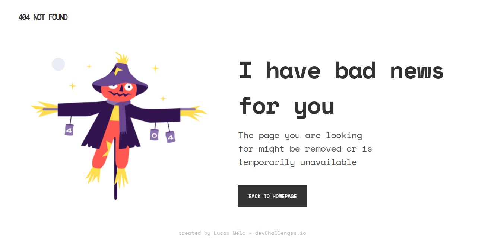

<h1 align="center">{Page Not Found - DevChallenge}</h1>

   Solution for a challenge from  <a href="http://devchallenges.io" target="_blank">Devchallenges.io</a>.

  <h3>
    <a href="https://lucasmelosilva.github.io/page-404-devchallenges/">
      Demo
    </a>
     | 
    <a href="https://github.com/lucasmelosilva/page-404-devchallenges">
      Solution
    </a>
     | 
    <a href="https://devchallenges.io/challenges/wBunSb7FPrIepJZAg0sY">
      Challenge
    </a>
  </h3>

## Table of Contents

- [Overview](#overview)
  - [Built With](#built-with)
- [Contact](#contact)

## Overview

A demostração da página pode ser encontrada [aqui.](https://lucasmelosilva.github.io/page-404-devchallenges/)

### Built with

- HTML
- CSS

## Contact

- E-mail: lucas.melo044@gmail.com
- whatsapp: 81 989030704
